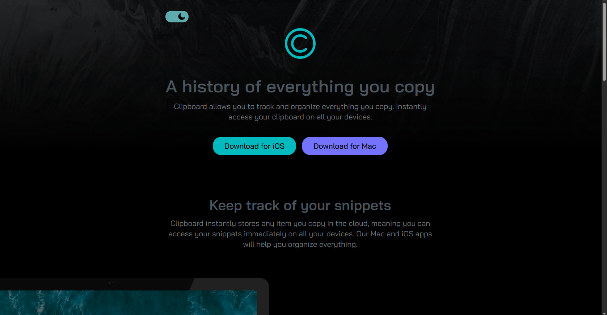

# Clipboard-landing-page-challenge

My solution to the Frontend Mentor Clipboard landing page challenge.
A responsive landing page solution for the [Frontend Mentor - Clipboard Landing Page Challenge](https://www.frontendmentor.io/challenges/clipboard-landing-page-5cc9bccd6c4c91111378ecb9), built with semantic HTML, modular SCSS, and clean CSS techniques.

---
## 🔗 Live Site

👉 [View Live Site](https://gamalhafez.github.io/clipboard-landing-page-challenge/)

---

## 📸 Screenshot

---

## 🛠 Tech Stack

- **HTML5** — semantic, accessible structure
- **CSS3** — clean base styles + transitions
- **SASS/SCSS** — modular partials, mixins, variables, and responsive breakpoints
- **Responsive Design** — mobile-first with flexible layout components

---

## 📐 Features

- ✅ Fully responsive layout (375px to 1440px)
- ✅ BEM-inspired class naming
- ✅ CSS Grid & Flexbox-based layout system
- ✅ Consistent spacing, typography, and theme
- ✅ Light & Dark theme support (via CSS custom properties + toggler)
